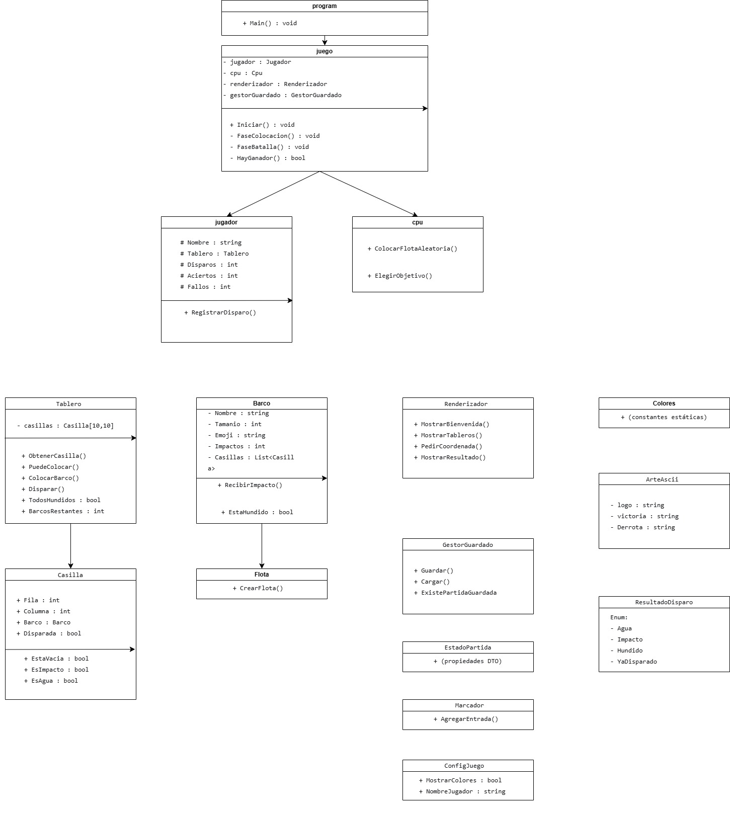

# Hundir la Flota - Proyecto POO AV2

## 👨‍🎓 Datos del Estudiante
- **Nombre:** Chorouq Lagmani
- **Curso:** Programación Orientada a Objetos AV2
- **Sesión:** 2 - Tablero y Flota

## 📊 Diagrama UML



## 🎮 Reglas del Juego

### La Flota
| Barco | Tamaño | Cantidad |
|-------|--------|----------|
| Portaaviones | 5 | 1 |
| Acorazado | 4 | 1 |
| Destructor | 3 | 1 |
| Submarino | 3 | 1 |
| Patrullera | 2 | 1 |

### Reglas de Colocación
- Los barcos se colocan en **horizontal o vertical** (nunca diagonal)
- No pueden salirse del tablero de **10×10**
- No pueden tocarse ni siquiera en **diagonal** (regla de adyacencia)

### Reglas de Disparo
- Turnos alternos entre jugador y CPU
- No se puede disparar a una coordenada ya atacada
- **Agua (~)**: disparo que no tocó barco
- **Impacto (X)**: disparo que tocó un barco
- **Hundido**: cuando todas las partes de un barco están impactadas

### Victoria
Gana el primero que hunda **todos los barcos** del rival.

## 🏗️ Estructura del Proyecto
HundirLaFlota/
├── src/
│ ├── Dominio/
│ │ ├── Casilla.cs
│ │ ├── Barco.cs
│ │ ├── Flota.cs
│ │ ├── Tablero.cs
│ │ └── ResultadoDisparo.cs
│ ├── Motor/
│ │ ├── Jugador.cs
│ │ ├── Cpu.cs
│ │ └── Juego.cs
│ ├── Presentacion/
│ │ ├── Renderizador.cs
│ │ ├── Colores.cs
│ │ └── ArteAscii.cs
│ └── Datos/
│ ├── GestorGuardado.cs
│ ├── EstadoPartida.cs
│ ├── Marcador.cs
│ ├── EntradaMarcador.cs
│ └── ConfigJuego.cs
├── Program.cs
└── HundirLaFlota.csproj


## ✅ Progreso
### Sesión 1 (Completa)
- [x] Diagrama UML
- [x] Estructura de carpetas
- [x] Clases vacías creadas
- [x] Proyecto compila

### Sesión 2 (En curso)
- [x] Clase Casilla implementada
- [x] Clase Barco implementada
- [x] Clase Flota implementada
- [x] Clase Tablero implementada
- [x] Renderizado básico del tablero

## 🚀 Cómo Ejecutar
```bash
dotnet build
dotnet run

